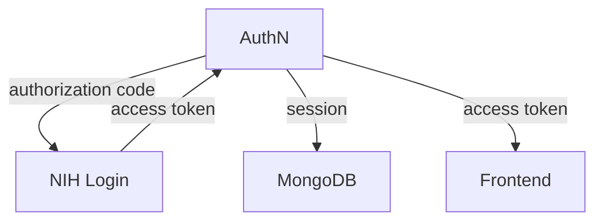
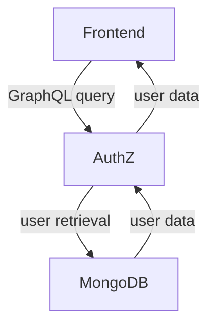

# CRDC Data Hub

The documentation in this repository explain how the parts of the CRDCD Data Hub application interact with each other.

## Table of Contents

1. [Components](#components)
2. [The Login Process](#the-login-process)
3. [Users](#users)

## Components

The CRDC Data Hub application consists of the following parts:

- [Frontend](https://github.com/CBIIT/crdc-datahub-ui)
- [Authentication (AuthN) service](https://github.com/CBIIT/crdc-datahub-authn)
- [Authorization (AuthZ) service](https://github.com/CBIIT/crdc-datahub-authz)
- [Backend service](https://github.com/CBIIT/crdc-datahub-backend)
- [NIH Login](https://auth.nih.gov/docs)
  - OAuth 2.0

## The Login Process

Logging in to CRDC Data Hub involves the following components:

- Frontend
- AuthN
- NIH Login
- MongoDB

Login occurs through the following steps:

1. User clicks "Login" in the CRDCDH frontend
2. CRDCDH Frontend redirects the user to NIH Login
    - Client ID included as a query parameter to allow using NIH Login
3. User submits either of two types of credentials
    - NIH
    - Login.gov
4. Upon successfully submitting valid credentials, NIH Login redirects the user back to the CRDCDH frontend
    - NIH Login includes an authorization code as a query parameter in the URL used to redirect the user back to the CRDCDH frontend
5. CRDCDH frontend sends a login POST request to AuthN with the following data in the request body:
    - `code` - The authorization code from NIH Login
    - `IDP` - The name of the identity provider (eg: `"nih"`)
    - `redirectUri` - The URL for NIH Login to use after processing AuthN's authentication request

    ```mermaid
    graph TD
      A[Frontend]
      B[NIH Login]
      C[AuthN]
      A -->|client ID| B
      B -->|authorization code| A
      A -->|authorization code| C
    ```

6. AuthN uses the authorization code to obtain an access token from NIH Login
7. AuthN creates a session in MongoDB
8. Frontend receives access token from AuthN



## Users

Retrieving and editing user data depends on the following components:

- Frontend
- AuthZ
- MongoDB

AuthZ offers many API endpoints for user information and management. Let's focus on user retrieval.

1. Frontend sends a POST request with a GraphQL `getMyUser` query to AuthZ
    - Frontend uses an access token to authorize its requests
2. AuthZ checks MongoDB for an existing user, creating one if it doesn't exist yet
3. AuthZ sends user information to the frontend


